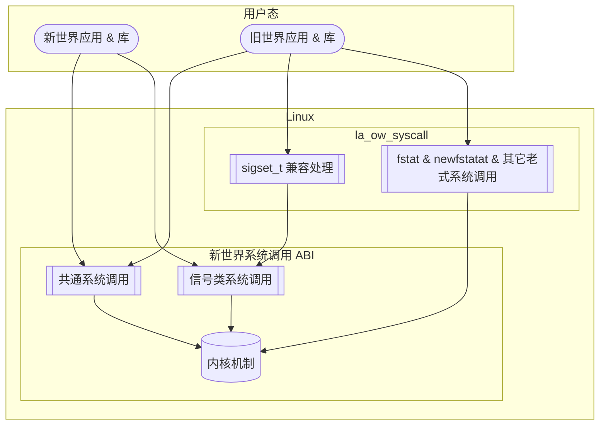
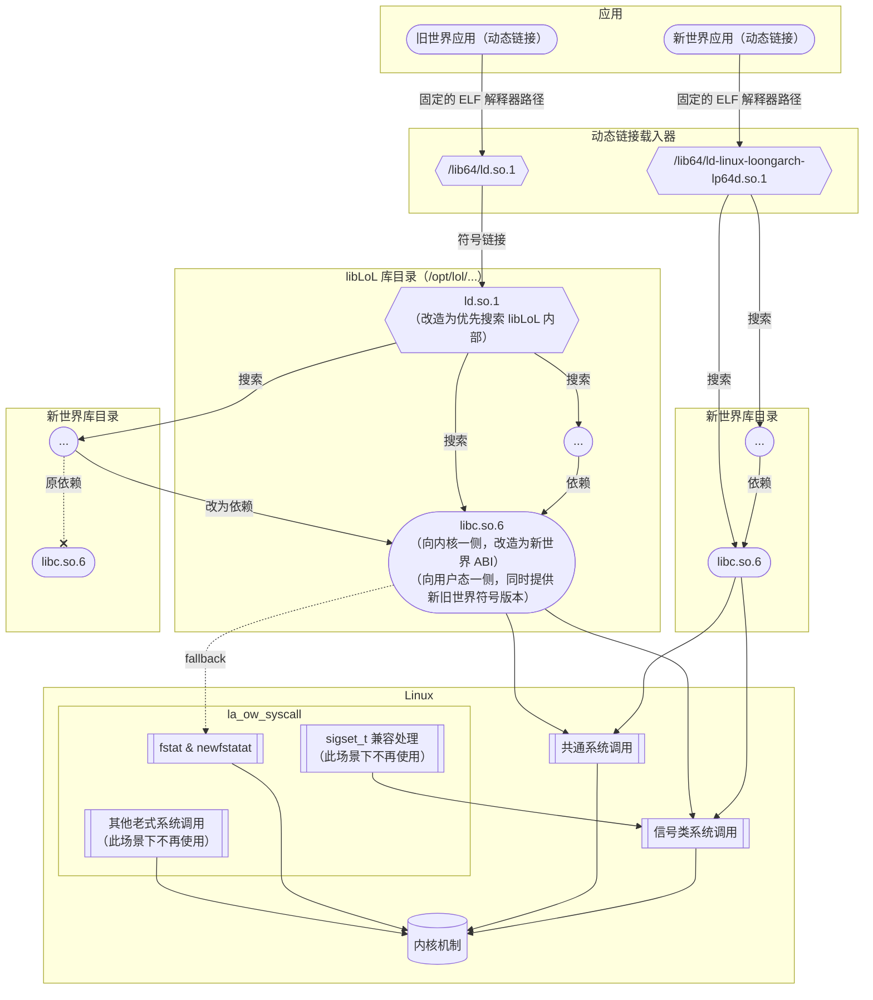

本文介绍了 libLoL 的实现原理，以及一些关键细节的处理。

本文描述的内容都是基于 libLoL 0.1.5 版本的现状而总结的。
本文的最后更新日期是 2024.04.02。

## 组成 {#components}

libLoL 主要由两部分组成：

* [内核模块](https://github.com/AOSC-Dev/la_ow_syscall)：提供旧世界系统调用 ABI 的支持。
* [运行时](https://github.com/AOSC-Dev/liblol)：为动态链接的旧世界应用提供依赖组件。

## 技术特点 {#features}

libLoL 的基本特点如下：

* 兼容性的方向：在新世界系统上提供旧世界兼容性。
* sysroot：没有单独的 sysroot，而是仅提供修改过的 glibc。该 glibc 同时提供新旧世界版本的符号，以便旧世界的可执行程序加载新世界的动态链接库，从而复用宿主系统已有的库。
* 内核：使用模块方式，动态 patch 系统调用表，不侵入架构无关逻辑。

这意味着：

* 磁盘空间方面，占用磁盘空间较小。
* 性能方面，额外开销可忽略不计。
* 侵入性方面，不存在侵入式修改，特别方便安装与卸载。
* 正确性方面，可以认为做到了非侵入方案所能做到的一切（详见[“讨论”一节](#discussions)）。这足以正常运行多数旧世界典型应用（如 WPS Office、QQ、龙芯浏览器）了。

## 架构 {#architecture}

在内核和用户态之间，系统调用兼容性的实现方式如下图。
此图所描述的数据流适用于静态链接的程序，或自己负责一部分系统调用的动态链接的程序：
这些程序的共同特点是部分或全部系统调用无法被 libLoL 在用户态轻易截获，因此必须在内核层面加入相应处理。

对依赖 glibc 的动态链接应用的支持方式如下图。
动态链接的程序或库，也可能绕过 libc 而自行做系统调用，此时的行为模式与上一张图所描述的相同。

## 讨论 {#discussions}

### 关于系统调用 ABI 的正确性 {#on-syscall-abi-correctness}

在系统调用 ABI 方面，加载了内核模块之后，异世界的系统调用方式也会被接受。
比方说，新世界不该存在的 `fstat` 便存在了，给 `sigaction` 的 `sizeof(sigset_t)`
参数传 16 也会被接受了。
相应地，如果一个旧世界程序有意以新世界方式进行系统调用，也会成功。
如果有软件用试探性的系统调用，探测当前系统是新世界还是旧世界（如[这个编译后仅 156 字节的检测程序](https://gist.github.com/xen0n/5ee04aaa6cecc5c7794b9a0c3b65fc7f)，
为 `rustup` 项目[所采用](https://github.com/rust-lang/rustup/blob/1.27.0/rustup-init.sh#L241)），
可能得到不准确的结果。
这在不做侵入式修改的前提下不可避免。

在信号处理方面，受限于目前允许新旧世界代码混合动态链接的架构，无法从理论上阻止一段代码从异世界拿到
signal handler 函数指针，进而调用本世界的 `sigaction`——用来注册 signal handler 的函数——将其注册。
于是，便可能出现将异世界形状的上下文（`ucontext_t`）传入 signal handler（的第三个参数），从而触发未定义行为的情况。
所幸，大多数 signal handlers 并不处理上下文参数，
因此该问题并未在实际测试中出现。

{}
有些读者可能会问：如果我们在动态链接器跟踪记录所有代码段的“世界类型”，再让 libc 跟踪记录当前程序申请到的所有内存区域的“世界类型”，
是不是就能精确识别某个 signal handler 的“世界类型”，进而做兼容了？

然而，这样势必带来巨大的实现复杂度和未必可忽略的运行时开销，因此考虑到当下的维护人力等因素，并不可行。

按照目前的实现，要想在一定程度上了解 signal handler 的来源世界信息，
最多只能依靠某次被调用的 `sigaction` 的 ELF 符号版本：
旧世界的代码一定链接到旧世界版本的 `sigaction`，新世界的代码则一定链接到新世界版本的 `sigaction`。
这应当能够让我们知晓，调用 `sigaction` 的代码来自哪个世界。
但即便如此，也无法解决前面提到的“本世界 `sigaction` 收到异世界 signal handler”的情况。
{}

因为 libLoL 打包的 glibc 是修改自新世界的，所以该 glibc 会以新世界方式发起所有系统调用。
因此对于动态链接到 glibc、所有系统调用都由 libc 代为发起的旧世界程序，
理论上可以仅使用新世界的系统调用为其提供服务，而不依赖 `la_ow_syscall` 内核模块。
但 Chromium 的沙箱机制是个特例：它不放行 `statx`，而期待 libc 回落至 `fstat` 等传统系统调用。
这在 LoongArch 之前总是可以工作，但 LoongArch 是首个去除了 `fstat` 的架构！
按照[Chromium 相关变更](https://chromium-review.googlesource.com/c/chromium/src/+/2823150)中的解释，
沙箱不放行 `statx` 是由于“不存在用 signal handler 将 `statx` 的调用改写为更安全形式的方法”；
无论如何，总之在提供 `fstat` 之外，是没有别的办法能兼容带有 Chromium 内核的存量二进制程序了。


关于 Chromium 沙箱机制涉及的具体细节，可参考《咱龙了吗？》项目维护的[技术文档](https://areweloongyet.com/docs/world-compat-details/)：关键词 `seccomp`。


为此，libLoL 的 glibc 包含了特殊处理：它的 `stat` 系列函数在 `statx` 系统调用不可用时，
会如同其他有 `fstat` 支持的架构一般，回退到 `fstat` 和 `newfstatat` 系统调用。
这就仍然要由 `la_ow_syscall` 内核模块提供兼容了。

### 关于库搜索路径的特殊处理 {#on-special-treatment-of-library-search-paths}

作为二进制软件分发的基本操作之一，部分软件会捆绑（bundle）提供一些动态链接库，
并通过可执行程序的 `RPATH`，或用 `LD_LIBRARY_PATH` 环境变量等方式使其可被搜索、加载到。
默认情况下，对于一个带有捆绑库的旧世界程序而言，这些被捆绑的旧世界动态链接库，
会先于新世界宿主系统提供的动态链接库，被搜索和加载。
这意味着如果：

* 这样的旧世界动态链接库（设为 `libA`）由于版本较低，提供的符号或符号版本不全，
* 并且可执行程序又依赖了系统提供的其他动态链接库（设为 `libB`），
* 并且 `libB` 依赖较新版本的 `libA`，

那么就会出现符号版本不匹配的情况，例如 `libB` 需要一个由 `libA` 提供的 `foo@LIBA_2.0`，而软件捆绑的低版本 `libA` 不能满足。
这种情况下，加载 `libB` 的动作便会失败。

为了应对这一情况，libLoL 打包的 glibc 提供了一个额外的路径，该路径中的动态链接库会先于
`RPATH` 或 `LD_LIBRARY_PATH` 环境变量中指定的路径被搜索。
默认情况下，该路径中包括了 libLoL 提供的全部 glibc 的动态链接库，以及由编译器提供的库，如 `libstdc++.so`。libLoL
也为用户提供了一个这样的路径，以便用户按需引入更多动态链接库供优先加载。

### 为何新世界程序加载旧世界库不可实现？ {#why-its-impossible-to-load-ow-libs-in-nw-apps}

libLoL 是非侵入方案，所以 libLoL 打包的 glibc 不会把新世界宿主系统的 glibc 替换掉，
宿主系统既有的可执行程序与库也感知不到 libLoL 的存在。
因此，新世界的可执行程序无法载入旧世界提供的动态链接库：一方面，宿主系统的 libc
不提供兼容旧世界的 ELF 符号版本，这是最主要原因；另一方面，也不知道这些旧世界库位于何处。

该需求较为罕见，但存在一种典型场景：输入法。
按照目前 Linux 常见的输入法支持架构，应用程序支持输入法的方式是由其图形界面工具库（GUI toolkit）如
GTK、Qt 等，在相应的插件目录，搜索并加载由输入法软件提供的动态链接库；
而旧世界的输入法软件，其提供的动态链接库是旧世界的，因此无法被新世界的应用程序载入。

由于 libLoL 采用非侵入宿主系统的设计，故从原理上无法支持旧世界输入法等“新世界应用载入旧世界插件"性质的场景。
这种情况下，只能重新编译（对于开源软件），或呼吁相关厂商适配新世界（对于闭源软件）。
